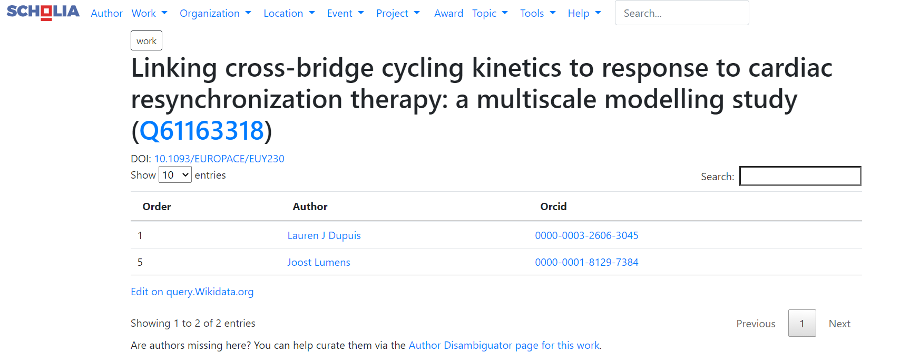
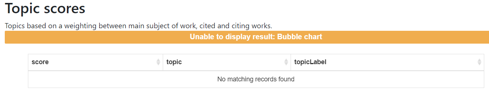
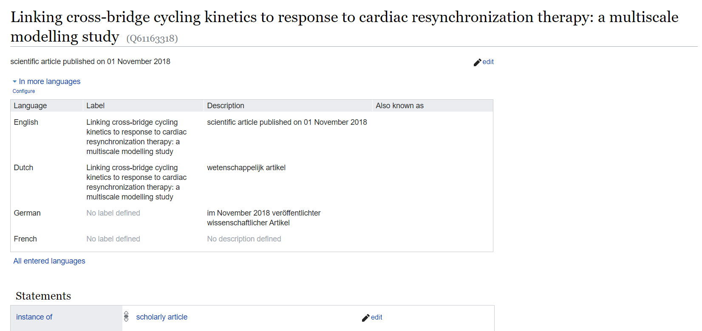
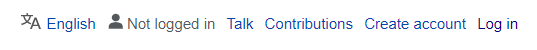
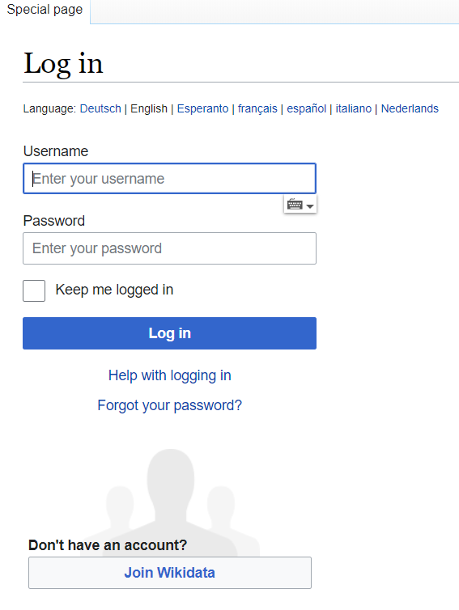
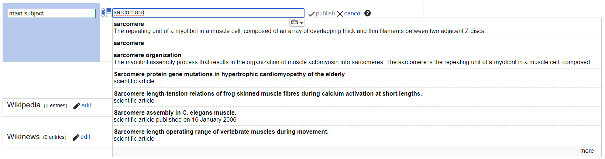
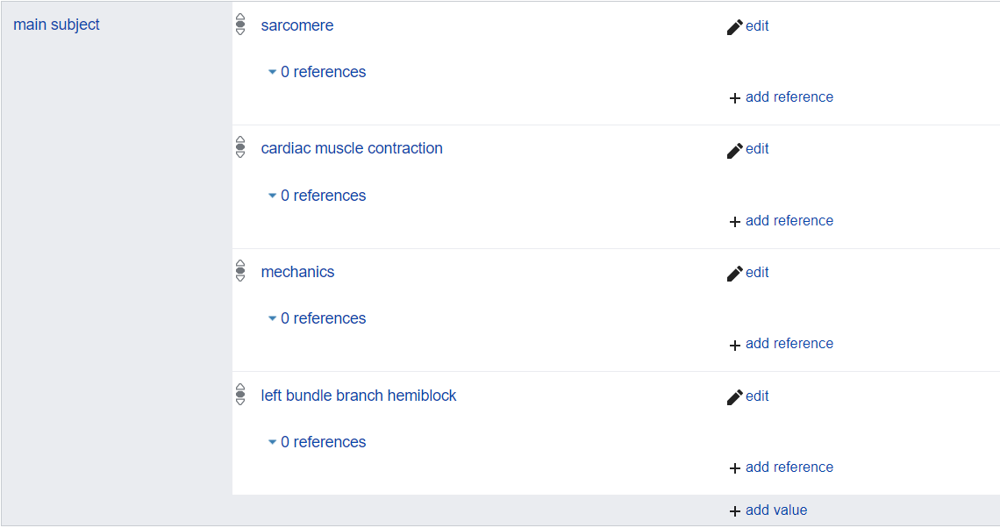
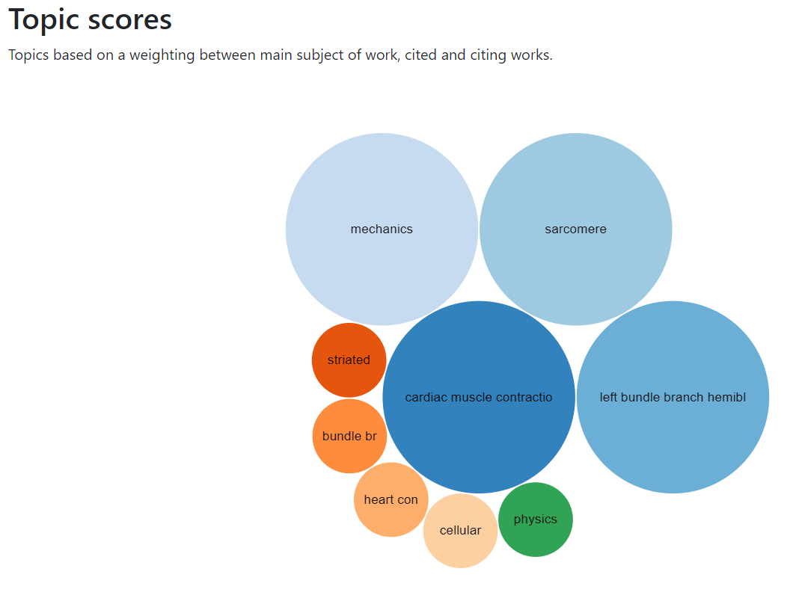
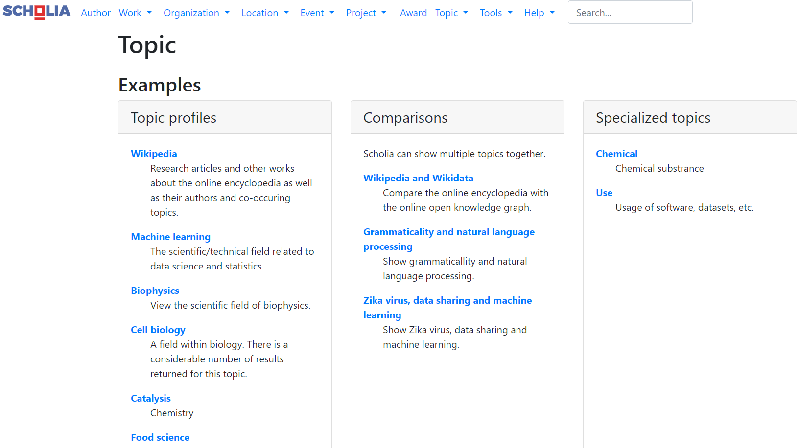
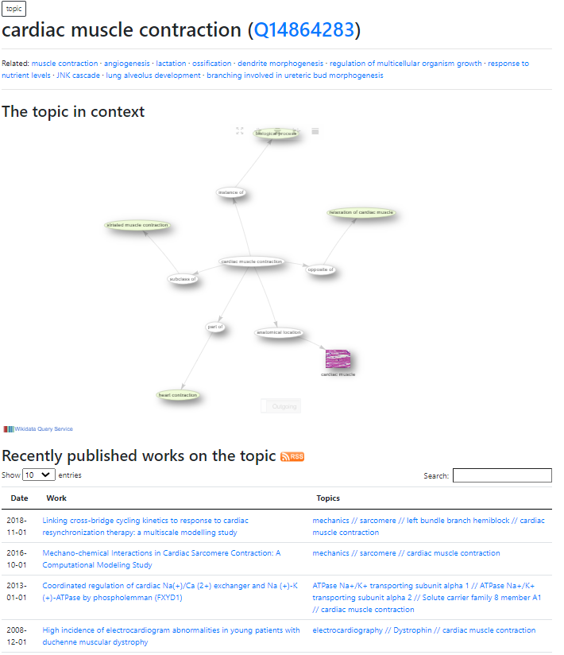

# Use Scholia and Wikidata to find scientific literature

According to [WikiData](https://www.wikidata.org/wiki/Wikidata:Scholia), 
> Scholia is a project to present bibliographic information and scholarly profiles of authors and institutions using Wikidata, the community-curated database supporting Wikipedia and all other Wikimedia projects. Scholia is being developed in the framework of the larger WikiCite initiative, which seeks to index bibliographic metadata in Wikidata about resources that can be used to substantiate claims made on Wikidata, Wikipedia or elsewhere. 

**Why should you use Scholia?**

Scholia is a useful tool for finding scientific literature. Based on the main topic of a publication, you can find literature similar to a publication you are looking into or literature you didn't know about or consider. Additionally, you can take advantage of all of the annotation work of others when finding literature. Proper annotation also makes scientific literature more findable.

**How does it work?**

Scholia accesses information from [WikiData](https://www.wikidata.org/wiki/Wikidata:Main_Page) to search the literature. This requires that the main subject of a publication is annotated in WikiData. However, the main topic of a publication must be manually added, so we rely on crowdsourcing for this project. The more people annotate scientific literature in WikiData, the more powerful the search function in Scholia will become. 

In this tutorial we will take you through the basic steps the help you learn to use Scholia for finding scientific literature. 

## Check Scholia to see if the publication you're looking for is annotated in WikiData
Go to the [Scholia homepage](https://tools.wmflabs.org/scholia/). Here you can use the search bar to look for the title of the publication. When you find the publication, the main page will look like this:

You can check whether the main topic of the publication is annotated in WikiData by scrolling down to the "Topic Scores" Section.

In this example, there are no matching records found, so we need to annotate the publication in WikiData. To do so, click on the identifier associated with the title of the publication at the top of the page which is Q61163318 in this case. This will bring you to the WikiData page for the publication of interest. The page contains multiple pieces of information about the publication including the author list, the publication date, the journal, work that it cites, etc.

## Annotate the main topic of a scientific publication in WikiData
Before annotating the publication on WikiData, you must be logged in. Click "log in" at the top right of the page.

The following page will appear. If you already have an account, log in. If not, create an account.

Scroll down the bottom of the Statements. There you will see a link with + add statement. Click on it, and the following box will appear.

In the "Property" search box, look for and select *main subject*. This will open up a box to the right where you can search for one of the main subjects of the publication. For example, we will search for *sarcomere* in this publication.

Press *publish* to save the main subject that you have added. You can add more main subjects by clicking + add value at the bottom of the box.

## Find similar publications based on main topic in Scholia
Once you have published your annotations for the main subjects, you can go back to Scholia and see what's happened to the main page of the publication. Your changes have now linked the publication to its main subjects, making that searchable for others.

Now you can search the main topic of the publication. You can choose to search through scientific literature by its [topic](https://tools.wmflabs.org/scholia/topic/). 

For this example, we will search the term *cardiac muscle contraction*. Under the *Recently published works on the topic* section, you can see the first option is the publication we just annotated followed by a list of other recently annotated publications. You can use the page to find related topics and publications.

### For more information about Scholia, you can refer to the [Frequently Asked Questions page](https://tools.wmflabs.org/scholia/faq). For more information about how to use WikiData, you can refer to the [WikiData tours page](https://www.wikidata.org/wiki/Wikidata:Tours). 

